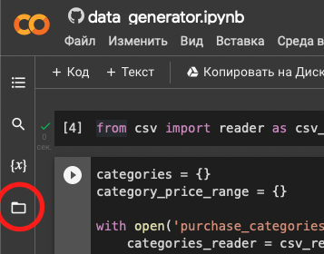
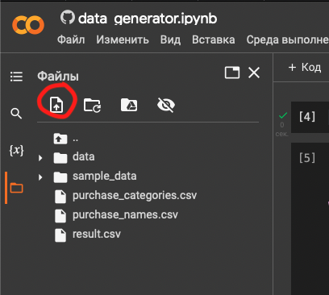

# Генератор данных

[Пример резултата](result.csv)

## Как самостоятельно сгенерировать

Скачиваем файлы [purchase_categories.csv](purchase_categories.csv) и [purchase_names.csv](purchase_names.csv).

### В файле `purchase_categories.csv` следующая структура:

На каждой строчке расположена категория. Данные по столбцам:

* имя категории
* минимальная цена генерации в категории
* максимальная цена генерации в категории
* вероятность выпадения категории

### В файле `purchase_names.csv` следующая структура:

На каждой строчке расположена имя продукта. Данные по столбцам:
* имя продукта
* к какой категории продукт относится
* вероятность выпадения продукта в категории
* вероятность обязательности продукта

Все вероятности (кроме вероятности обязательности продукта) неприведенные, то есть можно писать 
любое ‼️ПОЛОЖИТЕЛЬНОЕ‼️ число, вероятности будут нормированы. Вероятность обязательности продукта должна быть числом 
от 0 до 1 с дробной частью через точку `.`.

### Как запустить генерацию
Скачиваем [файл скрипта](data_generator.ipynb), заходим на [Google colab](https://colab.research.google.com), нажимаем
`Файл -> Загрузить блокнот -> Загрузить` и загружаем файл `data_generator.ipynb`. 
Затем  слева нажимаем кнопку 

далее 

и загружаем файлы `purchase_categories.csv` и `purchase_names.csv`. Далее нажимаем `Среда Выполнения -> Выполнить все`. 
И во вкладке файлы появится обновленный файл `result.csv`.

Переменной `desired_num_of_rows` можно регулировать количество сг